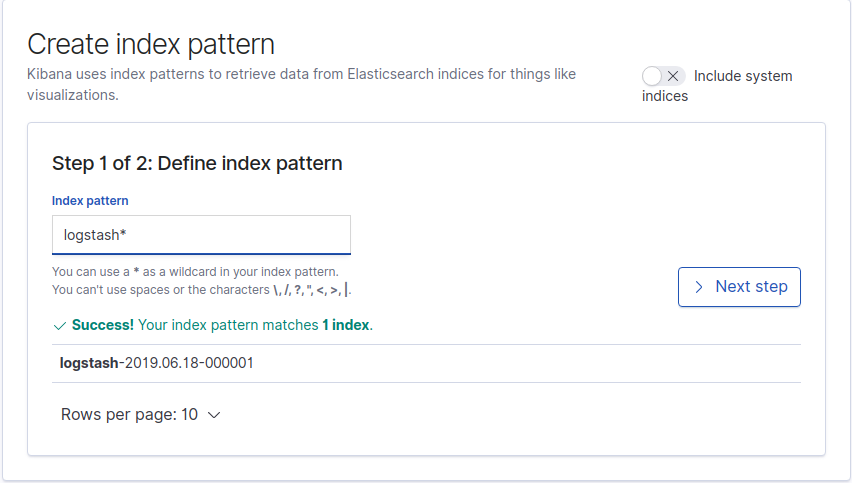

* Running the setup - `docker-compose up --build`

## NOTE
- This setup will start your complete elk stack including elastic search , kibana, logstash and logspout.
Now whatever containers you will run on your host machine , logspout will capture their logs and send them to logstash.
- If you run a container having nginx(or any kind of container) send the nginx logs to stdout as logspout captures the logs from there only.
- To ignore the logs of certain containers you can put `LOGSPOUT=ignore` (as shown in `docker-compose.yml`) file in the environment variable if the containers to be ignored.

---
 

## Configuring Kibana

##### Assuming your apps are up and running following are the steps to collect logs and do the visualization 
 ---
* Open kibana go to the `Management` tool in the lower left corner.
* There you'll see an `Index management` button in lower left corner, click on it to create a new index.

* Enter `logstash-` in input then click on `Next step` then select `@timestamp` from the drop-down and your index would be created
* Now go to `discover` section of Kibana. There you'll able to see the logs. 

* click on any of logs shown to get more information regarding the log.

***
